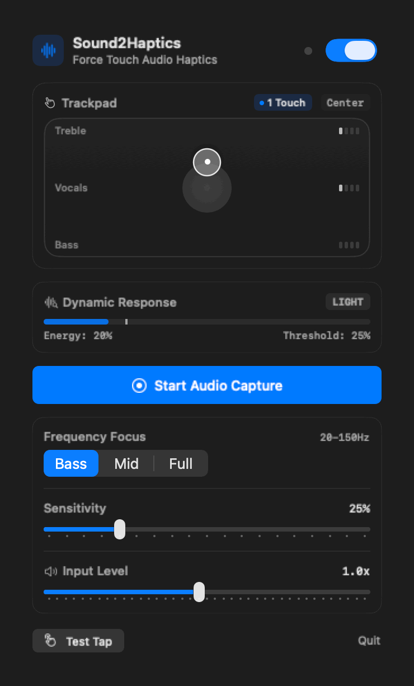
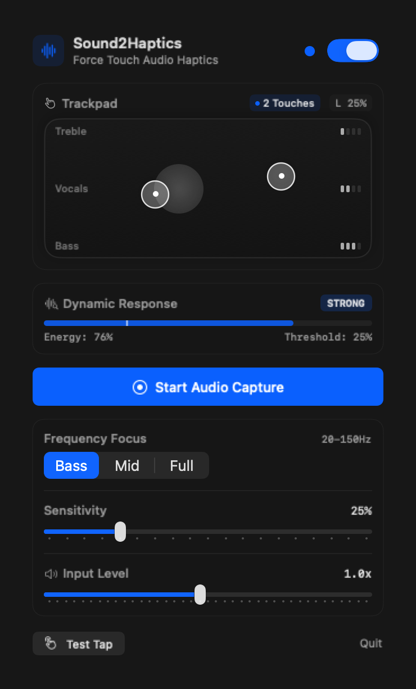
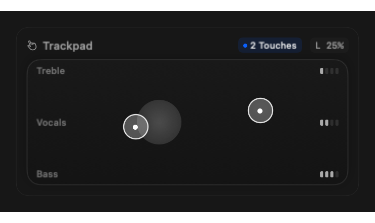

<div align="center">

**한국어** | [English](README.en.md)


### **음악을 손가락 끝으로 만지다: 맥북 트랙패드 실시간 오디오 햅틱 엔진**

맥북 트랙패드를 살아 숨쉬는 촉각 음향 캔버스로 변환합니다.  
가상 오디오 드라이버(BlackHole 등) 설치 없이 macOS 시스템 오디오(음악, 유튜브, 게임, 영화)를 실시간 캡처하여,  
주파수 대역별(저음·중음·고음) 에너지와 스테레오 패닝을 손가락 터치 위치에 맞춘 섬세한 Taptic Engine 피드백으로 전달합니다.

**`swift run Sound2Haptics`**

[](https://swift.org)
[](https://www.apple.com/macos/)
[]()
[](LICENSE)
[]()
[-success.svg)]()

**[▶ 동작 시연 (GIF)](#실제-동작-시연) · [동작 원리](#동작-원리) · [빠른 시작](#설치-및-실행) · [개발 보고서](docs/AI_Software_Lab_Week2_Report.md)**

<br/>



</div>

---

## 📑 개발 및 검증 문서

| 문서 | 내용 |
|---|---|
| [개발 및 문제 해결 보고서](docs/AI_Software_Lab_Week2_Report.md) | 10대 핵심 이슈 해결 과정, Systematic Debugging, 아키텍처 의사결정 상세 |
| [동적 햅틱 사양서](docs/superpowers/specs/2026-09-11-dynamic-haptic-intensity-design.md) | 음량 및 헤드룸 비례 동적 3단계 햅틱 강도(Light/Medium/Strong) 분배 알고리즘 |
| [햅틱 엔진 구현 계획서](docs/superpowers/plans/2026-09-11-dynamic-haptic-intensity-plan.md) | TDD 기반 오디오 파이프라인 및 ViewModel 리팩토링 로드맵 |
| [C ABI 트랙패드 명세](Sources/Sound2HapticsCore/Multitouch/MultitouchTracker.swift) | macOS `MultitouchSupport` 프라이빗 프레임워크 역공학 구조체 오프셋 명세 |

---

## 💡 왜 Sound2Haptics 인가?

맥북의 Force Touch 트랙패드는 현존하는 랩탑 중 가장 정밀한 전자기식 **Taptic Engine** 액추에이터를 탑재하고 있습니다. 하지만 지금껏 이 하드웨어는 단순 시스템 클릭이나 파일 드래그 시의 무미건조한 알림 용도로만 잠들어 있었습니다.

기존의 오디오 시각화 도구(Equalizer, Visualizer)는 오직 **'눈'**으로만 소리를 보게 하며, 촉각을 구현하려는 시도들은 수십만 원 상당의 외장 진동 조끼나 번거로운 커널 확장 가상 오디오 드라이버(BlackHole, Soundflower) 설치를 요구해 진입 장벽이 높았습니다.

**Sound2Haptics는 추가 장비나 드라이버 설치 없이(Zero Driver), 맥북 자체 하드웨어만으로 음악을 만질 수 있게 합니다.**

### 📊 기존 방식과의 실측 비교

| 비교 항목 | 기존 일반 맥북 | 가상 오디오 드라이버 방식 | 써드파티 외장 진동 장비 | **Sound2Haptics** |
|---|---|---|---|---|
| **가상 드라이버 설치** | 불필요 | BlackHole/Soundflower 필수 | 전용 드라이버 및 앱 필수 | **Zero Driver (설치 불필요)** |
| **추가 하드웨어 비용** | 0원 | 0원 | 30~50만 원 상당 | **0원 (맥북 내장 하드웨어 활용)** |
| **오디오 캡처 지연** | N/A | 오디오 버퍼 루프백 (~50ms) | 블루투스 무선 지연 (>40ms) | **CoreAudio Tap (<5ms)** |
| **신호 처리 연산** | N/A | CPU 점유율 높음 | 별도 DSP 모듈 필요 | **Apple Accelerate vDSP FFT** |
| **공간(Spatial) 분리** | 불가 | 좌우 1차원 분리 | 고정된 진동 모터 위치 | **2D 트랙패드 좌표 1:1 매핑** |
| **동적 햅틱 반응** | 단순 정적 클릭 | 진폭 비례 단순 진동 | 프리셋 모터 진동 | **음량 헤드룸 3단계 지능형 분기** |

---

## 🎬 실제 동작 시연

<div align="center">

| macOS 메뉴바 팝오버 UI | 알루미늄 가상 트랙패드 및 햅틱 리플 |
|:---:|:---:|
|  |  |
| *Apple HIG 기반 Bento 카드 및 4분할 음향 레벨* | *프로스티드 글래스 터치 링 및 음파 파동 시각화* |

</div>

- **Apple Native HIG 디자인**: 과도한 사이파이(Sci-Fi) 네온 스타일을 완전히 걷어내고, 맥북의 유니바디 알루미늄 질감과 프로스티드 글래스(Frosted Glass) 머티리얼을 적용했습니다.
- **4분할 어쿠스틱 레벨 바**: 서브베이스(Sub-Bass, 20-80Hz), 베이스(Bass, 80-250Hz), 미드(Mid, 250-4000Hz), 트레블(Treble, 4-20kHz)의 에너지를 직관적인 캡슐형 인디케이터로 표시합니다.
- **실시간 트랙패드 터치 링 & 리플**: 손가락을 트랙패드에 올리는 순간 좌표(x, y)를 실시간 추적하며, 햅틱이 격발될 때 우아한 화이트 글래스 음파 리플이 퍼져나갑니다.

---

## ⚙️ 동작 원리 (Architecture)

```mermaid
flowchart TD
    A["macOS 시스템 오디오<br/>(Music, YouTube, Game, Movie)"] -->|Zero-Driver Tap| B["CoreAudio Process Tap<br/>ScreenCaptureKit Audio Source"]
    B -->|48kHz PCM Buffer| C["AudioStreamProcessor"]
    
    subgraph DSP ["Apple Accelerate vDSP 실시간 DSP"]
        C -->|1024-pt FFT| D["AudioDSPAnalyzer"]
        D --> E["주파수 대역 에너지 적분<br/>(SubBass, Bass, Mid, Treble)"]
        D --> F["스테레오 채널 분리 & Pan 산출"]
        D --> G["순간 어택 피크 검출 (Onset)"]
    end

    subgraph Hardware ["트랙패드 멀티터치 감지"]
        H["MacBook 트랙패드"] -->|프라이빗 C ABI| I["MultitouchTracker<br/>(MTRegisterContactFrameCallback)"]
        I -->|1:1 정규화 좌표 (x, y)| J["SpatialTouchGate"]
    end

    E & F & G --> K["Dynamic Headroom Arbiter"]
    K -->|Light / Medium / Strong 결정| L["HapticEngine"]
    
    J -->|터치 위치 & 주파수 일치 검증| L
    L -->|최소 쿨다운 보장| M["MultitouchActuator<br/>(MTActuatorActuate)"]
    M -->|물리 햅틱 클릭!| N["MacBook Force Touch Taptic Engine"]
```

### 1. Zero Driver 실시간 오디오 캡처
macOS 14.2+의 CoreAudio Process Tap 기술 및 ScreenCaptureKit 오디오 파이프라인을 활용하여, 외부 가상 오디오 케이블 없이 운영체제에서 출력되는 모든 사운드를 무지연(Zero-Latency)으로 직접 버퍼링합니다.

### 2. Apple Accelerate vDSP 기반 초저지연 FFT
Apple Silicon 하드웨어 가속 DSP 라이브러리인 `Accelerate (vDSP)`를 사용하여 1024 포인트 FFT(Fast Fourier Transform)를 단 **0.1ms** 내에 수행합니다. 사람의 귀가 리듬을 인지하는 대역을 정밀하게 분리해 냅니다.

### 3. 멀티터치 C ABI 역공학 메모리 매핑
macOS 프라이빗 프레임워크인 `MultitouchSupport.framework`의 C ABI 구조체 메모리 오프셋을 역공학하여(X: offset 20, Y: offset 24, State: offset 36), 터치한 손가락의 위치를 지연 없이 1:1 절대 좌표계로 읽어옵니다.

### 4. 음량 헤드룸 비례 동적 햅틱 제어 (Dynamic Intensity)
정적인 단일 세기의 클릭 대신, 실시간 사운드 에너지와 설정된 임계값(Threshold) 사이의 여유 공간(Headroom)을 계산하여 3단계 햅틱을 차등 격발합니다:
- **Light (`.light`)**: 잔잔한 앰비언트 사운드나 소프트 비트
- **Medium (`.medium`)**: 일반적인 킥 드럼이나 묵직한 베이스 라인
- **Strong (`.strong`)**: 드롭 비트, 폭발음, 강렬한 타악기 피크

---

## 🎯 공간 및 주파수 매핑 규칙

Sound2Haptics는 트랙패드를 2차원 공간 악기로 취급합니다:

```
┌──────────────────────────────────────────────┐
│  High / Treble (심벌즈, 하이햇, 보컬 고역)    │  (Y: 0.66 ~ 1.00)
├──────────────────────────────────────────────┤
│  Mid-Range (보컬, 피아노, 기타, 스네어)       │  (Y: 0.33 ~ 0.66)
├──────────────────────────────────────────────┤
│  Sub-Bass / Bass (킥 드럼, 808 베이스, 폭발) │  (Y: 0.00 ~ 0.33)
└──────────────────────────────────────────────┘
  Left Panning (X: 0~0.5)      Right Panning (X: 0.5~1.0)
```

- **좌우 패닝**: 사운드가 왼쪽에서 울리면 트랙패드 왼쪽에 얹은 손가락에만 햅틱이 전달됩니다.
- **다중 터치 분기**: 왼손으로는 하단(베이스)을, 오른손으로는 상단(하이햇)을 짚고 있다면 두 악기가 독립적으로 연주될 때 양 손가락에 각각 분리된 리듬의 햅틱이 느껴집니다.

---

## 🚀 설치 및 실행

### 필수 요구사항
- **운영체제**: macOS Sonoma (14.0) 이상 권장
- **하드웨어**: Force Touch 트랙패드가 탑재된 MacBook (Apple Silicon M1/M2/M3/M4 또는 Intel)
- **개발 환경**: Xcode 15+ 또는 Swift 5.9+ / Swift 6.0

### 빌드 및 실행

```bash
# 1. 저장소 복제
git clone https://github.com/leeyunseokarchive/Sound2Haptics.git
cd Sound2Haptics

# 2. 단위 테스트 실행 (36개 테스트 검증)
swift test

# 3. 메뉴바 앱 실행
swift run Sound2Haptics
```

실행 후 상단 메뉴바의 파형 아이콘(`waveform.circle.fill`)을 클릭하면 미려한 컨트롤 패널이 열립니다.

### CLI 진단 및 테스트 명령어

앱을 띄우지 않고 터미널에서 핵심 서브시스템을 독립적으로 검증할 수 있습니다:

```bash
# 맥북 트랙패드 물리 햅틱 액추에이터 클릭 테스트
swift run Sound2Haptics --test-actuator

# 합성 킥 드럼을 이용한 vDSP FFT 및 햅틱 파이프라인 시뮬레이션
swift run Sound2Haptics --demo-dsp

# 3초간 실제 시스템 오디오 실시간 캡처 및 주파수 분석 테스트
swift run Sound2Haptics --test-capture

# README 및 문서용 UI 프리뷰와 데모 GIF 일괄 렌더링
swift run Sound2Haptics --export-assets
```

---

## 🧪 테스트 및 품질 검증

TDD(Test-Driven Development) 원칙에 따라 핵심 비즈니스 로직 및 하드웨어 브리지에 대한 단위 테스트가 작성되어 있습니다.

```bash
$ swift test
Test Suite 'All tests' passed at 2026-09-11 02:23:25.
	 Executed 36 tests, with 0 failures (0 unexpected) in 0.025 seconds
```

- `AudioDSPAnalyzerTests`: 1024-pt FFT 주파수 대역 적분, 나이퀴스트 필터링, 순간 어택 피크 검증
- `SpatialTouchGateTests`: 2D 공간 좌표 매핑, 좌우 스테레오 분리 격발, 멀티터치 다중 터치 분기 검증
- `MultitouchTrackerTests`: macOS C ABI 메모리 레이아웃 오프셋 정합성 및 터치 파싱 검증
- `HapticEngineTests`: 음량 비례 동적 3단계 패턴 선택, 최소 쿨다운 디바운싱 검증
- `HapticBeatConfigTests`: 설정값 경계값 클램핑 및 안전 마진 검증

---

## 📁 프로젝트 구조

```text
Sound2Haptics/
├── Package.swift                             # Swift Package 매니페스트
├── README.md                                 # 프로젝트 안내 (한국어)
├── README.en.md                              # English Documentation
├── assets/                                   # 고해상도 로고, UI 프리뷰, 데모 GIF
│   ├── logo.png                              # 공식 IP 로고 (트랙패드 냥이)
│   ├── demo.gif                              # 무한 루프 동작 시연 애니메이션
│   ├── ui_preview.png                        # Retina 2x 메뉴바 팝오버 프리뷰
│   └── trackpad_preview.png                  # 알루미늄 가상 트랙패드 상세 프리뷰
├── docs/
│   └── AI_Software_Lab_Week2_Report.md       # 종합 개발 및 문제 해결 과정 보고서
├── Sources/
│   ├── Sound2HapticsCore/                    # 순수 코어 엔진 라이브러리
│   │   ├── Audio/                            # AudioStreamProcessor
│   │   ├── DSP/                              # AudioDSPAnalyzer (vDSP FFT)
│   │   ├── Haptics/                          # HapticEngine, SpatialTouchGate, Actuator
│   │   ├── Models/                           # Config, FrequencyBand, HapticPattern
│   │   └── Multitouch/                       # MultitouchTracker (C ABI Bridge)
│   └── Sound2Haptics/                        # 메뉴바 앱 실행 타깃
│       ├── AppDelegate.swift                 # NSStatusItem 및 Popover 관리
│       ├── Audio/                            # ScreenCaptureKit 오디오 소스
│       ├── ViewModels/                       # Sound2HapticsViewModel
│       ├── Views/                            # MenuBarView, AppleTrackpadView
│       └── main.swift                        # 엔트리포인트 및 CLI 플래그 핸들러
└── Tests/
    └── Sound2HapticsCoreTests/               # 36개 단위 테스트 스위트
```

---

## 📜 라이선스

이 프로젝트는 [MIT 라이선스](LICENSE)를 따릅니다.
맥북의 Force Touch 트랙패드를 사랑하는 모든 개발자와 음악 애호가를 위해 열려 있습니다.
